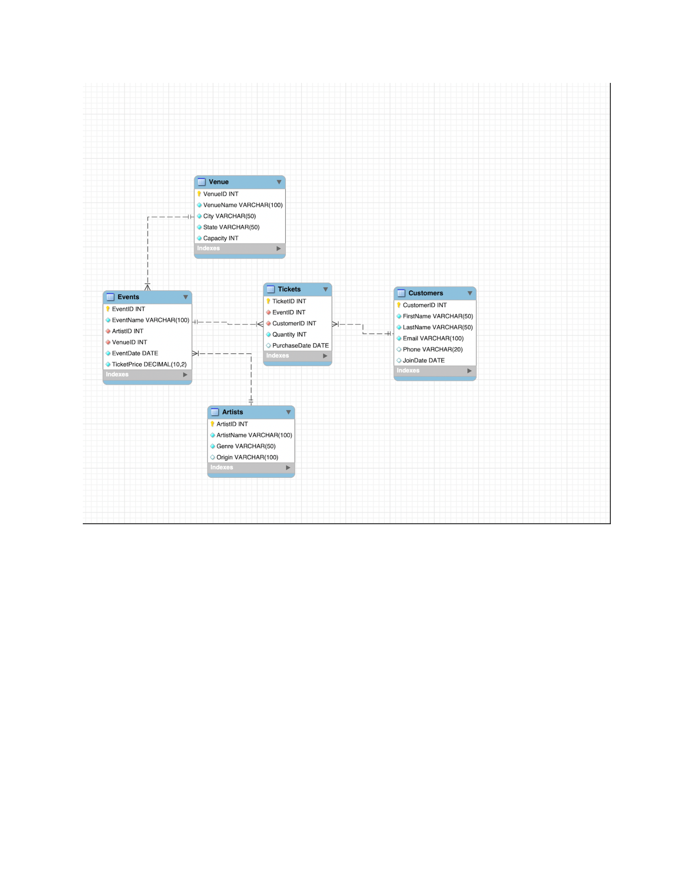

# MIST4610-project1- Group 4
# Team Name: 
  63756 Group 4 
  
# Team Name:
  1. Karwan Gardi [@KarwanGardi](https://github.com/KarwanGardi)
   
  2. Afaf Khurram [@Ak87319](https://github.com/ak87319)

  3. Akash Kodali [@Ank1234538](https://github.com/Ank1234538)
     
  4. Olvia Lucas [@livlucas04-bit](https://github.com/livlucas04-bit)

# Problem Description
The Venue Management Database is designed to simplify and optimize the day-to-day operations of an event venue. It enables managers to efficiently track revenue, monitor venue capacity, and manage ticket distribution per guest. By consolidating these processes into one system, the database improves accuracy, reduces manual effort, and generates insights that support smarter business decisions. In turn, it helps the venue deliver a smooth, enjoyable experience for guests while maintaining strong financial performance and resource utilization.

# Data Model 
 This following data model shows the operations that are utlizated by an event management team. The operations include venues, artists, customers, and ticket sales. The Venue entity contains information such as name,location, and the capacity of each venue. The Events entity connects the Venue table and the Artist table, specifying which performer is performing at a certain event. The sales of tickets are tracked through the Tickets table, and customer information, including Customer ID, full name, and contact details, is stored in the Customer table. 
  The Venue and Artist tables have a one-to-many relationship with the Entity table because one venue can have multiple events, but only one event is tied to a single venue. Similarly, with the Artist table, one artist can perform at many different events, but one event is tied to one artist. 
    The Events table also has a one-to-many relationship with the Tickets table. This states that there could be many ticket sales for one event, but each ticket is uniquely tied to one event. This directly relates to the Customers table as well, as one customer can by multiple tickets but each ticket is related to one customer. 
    There is also a many-to-many relationship between Events ,Customers, and Tickets. While a customer can attend many events and events can have many customers, the linking party ( weak entity) is the tickets table. 

# Data Dictionary 

-1.png)

# Queries 

1) List of all Customers
   - This query is useful for managers to see all the customers names and contact information to reach out to them for more events
     
2) List of all events
   - Useful for managers to gain oversight all events and useful for planning strategies.
     
3) Venues and Capacity
    - Shows where events take place and the max limit for customers
    - Useful for managers in event planning and adhering to safety compliances.
      
4) Ticket Purchases by Customers
   - Shows customers their purchases
   - Useful for managers to see patterns in buying and sales.
     
5) Total revenue by event
   - shows which events generate the most revenue
   - Useful for managers to evaulate events
     
6) Top 5 artists by Revenue
   - Shows which artist are the most profitable
   - Helps managers decide to book a certain artist or not.
     
7) Events with ticket sales
   - Only shows events that have sold tickets
   - This is useful for managers to find events that are not selling , which can result in increased promotion for future events
     
  8) Venues By revenue
     - This shows which venues have generated the most revune and is ordered by most to least
     - This can help managers decide if the venue is good for the artist or not , it also helps decide future bookings. If an event is not booking as well , then a change of venue can be decided

  9) Average Ticket Prices per venue
      - This shows trends in pricing for venues
      - Query can help decide if there should be discounts or pricing increasing based on this information. If the price is too high for events, that information can be tracked to artists or events and discounts can be granted
    
  10) Top 5 Customers by spending
      - Shows the customers who spend the most
      - Useful for managers to create loyalty progranms or increasing advertising towards those specific people because they are bringing in the most money. 
  

